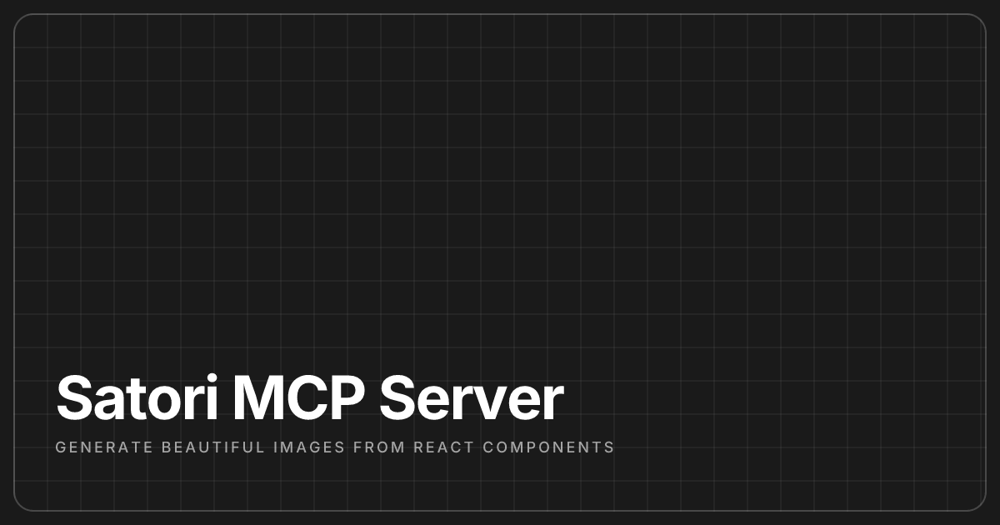

# Satori MCP Server

An MCP (Model Context Protocol) server that generates beautiful images from React components using [Satori](https://github.com/vercel/satori). Create social cards, blog headers, quotes, and custom images directly through AI assistants like Claude.

<div>
<a href="https://jellypod.ai"></a>
<a href="https://github.com/Jellypod-Inc/satori-mcp-server/blob/main/LICENSE"></a>

</div>

## Features

- 🎨 **Generate images from JSX** - Convert React components to PNG images
- 📝 **Built-in templates** - Social cards, blog headers, and quote designs
- 🔤 **Google Fonts support** - Access to hundreds of fonts
- 🚀 **MCP Protocol** - Works seamlessly with Claude Desktop and other MCP clients
- 🛠️ **TypeScript** - Fully typed!

## Installation

### Prerequisites

- Node.js 20+
- pnpm (recommended) or npm

### Clone and Install

```bash
git clone https://github.com/Jellypod-Inc/satori-mcp-server.git
cd satori-mcp-server
pnpm install
```

### Configure with Claude Desktop

To use the hosted version of the MCP server, add the server to your Claude Desktop configuration:

```json
{
  "mcpServers": {
    "satori": {
      "type": "http",
      "url": "https://satori.jellypod.ai/mcp"
    }
  }
}
```

## Development

```bash
# Start development server with hot reload
pnpm dev

# Run tests
pnpm test

# Run specific tests
pnpm test:generate-image
pnpm test:generate-image-from-template

# Build for production
pnpm build

# Start production server
pnpm start
```

### Testing
To test the MCP server, use the Model Context Protocol (MCP) inspector: https://modelcontextprotocol.io/legacy/tools/inspector

You can run it via:

```
pnpm dlx @modelcontextprotocol/inspector
```

and then run the local MCP server, and connect to the localhost in the inspector.


### Environment Variables
You willl need to configure Vercel Blob Storage to save the generated image files.
Get this from your Vercel dashboard: https://vercel.com/docs/storage/vercel-blob

```
export const BLOB_READ_WRITE_TOKEN = process.env.BLOB_READ_WRITE_TOKEN;
```


## Available Tools

### 1. `generate_image`
Generate an image from custom JSX content.

**Parameters:**
- `jsx` (string, required): JSX content as a string
- `width` (number, default: 600): Image width in pixels
- `height` (number, default: 400): Image height in pixels
- `outputPath` (string, required): Where to save the image
- `googleFonts` (array, optional): Google Fonts to load

**Example:**
```javascript
{
  jsx: '<div style={{background: "linear-gradient(to right, #667eea, #764ba2)", width: "100%", height: "100%", display: "flex", alignItems: "center", justifyContent: "center"}}><h1 style={{color: "white", fontSize: "60px"}}>Hello World</h1></div>',
  width: 1200,
  height: 630,
  outputPath: "output/hello.png",
  googleFonts: [
    { name: "Inter", weight: 700, style: "normal" }
  ]
}
```

### 2. `generate_from_template`
Generate an image using a pre-built template.

**Parameters:**
- `template` (string, required): Template name ("social-card", "blog-header", "quote")
- `params` (object, required): Template-specific parameters
- `outputPath` (string, required): Where to save the image
- `width` (number, optional): Override template width
- `height` (number, optional): Override template height

**Example:**
```javascript
{
  template: "social-card",
  params: {
    title: "Announcing Satori MCP Server",
    description: "Generate beautiful images with AI",
    backgroundColor: "#2563eb"
  },
  outputPath: "output/announcement.png"
}
```

### 3. `list_templates`
List all available templates with their descriptions.

**No parameters required**

Returns a list of templates with their names and descriptions.

## Templates

### Social Card (1200x630)
Perfect for social media sharing cards.

**Parameters:**
- `title` (string, required): Main heading
- `description` (string, optional): Supporting text
- `backgroundColor` (string, optional): Background color (default: #1a1a1a)

### Blog Header (1200x480)
Ideal for blog post headers.

**Parameters:**
- `title` (string, required): Blog post title
- `author` (string, required): Author name
- `date` (string, required): Publication date
- `category` (string, optional): Post category

### Quote (1080x1080)
Square format for inspirational quotes.

**Parameters:**
- `quote` (string, required): The quote text
- `author` (string, optional): Quote author
- `backgroundColor` (string, optional): Background color

## Creating Custom Templates

Add new templates in `src/templates/`:

```typescript
import React from "react";
import type { Template } from "./index";

export const myTemplate: Template = {
  name: "my-template",
  description: "My custom template",
  defaultSize: { width: 1200, height: 630 },
  googleFonts: [
    { name: "Inter", weight: 700, style: "normal" }
  ],
  generate: (params: { title: string }) => {
    return (
      <div style={{
        width: "100%",
        height: "100%",
        display: "flex",
        alignItems: "center",
        justifyContent: "center",
        backgroundColor: "#000",
        color: "#fff",
        fontFamily: "Inter"
      }}>
        <h1>{params.title}</h1>
      </div>
    );
  },
};
```

Then register it in `src/templates/index.ts`:

```typescript
import { myTemplate } from "./my-template";

export const templates: Record<string, Template> = {
  // ... existing templates
  "my-template": myTemplate,
};
```

## Testing

The project includes comprehensive tests for all tools and templates:

```bash
# Run all tests
pnpm test

# Test outputs are saved in tests/output/
# Images are generated to verify actual functionality
```

Test structure:
- Each template has multiple test cases (basic, edge cases, custom styling)
- Tools are tested for proper MCP response format
- Actual PNG images are generated to verify output

## Architecture

Built with:
- [xmcp](https://xmcp.dev) - TypeScript framework for MCP servers
- [Satori](https://github.com/vercel/satori) - Convert HTML/CSS to SVG
- [@resvg/resvg-js](https://github.com/yisibl/resvg-js) - Convert SVG to PNG
- Google Fonts API - Dynamic font loading

### Large Image Handling

Rather than responding with a base64 encoded image, the server saves the image to Vercel Blob storage and responds with a reference url to the object. Most MCP clients and responses have size limitations.

The url is publically accessible, but obfuscated with a large random string appended to the file name.

## Contributing

Contributions are welcome! Please feel free to submit a Pull Request.

1. Fork the repository
2. Create your feature branch (`git checkout -b feature/amazing-feature`)
3. Commit your changes (`git commit -m 'Add amazing feature'`)
4. Push to the branch (`git push origin feature/amazing-feature`)
5. Open a Pull Request

## License

Mozilla Public License Version 2.0 - see [LICENSE](LICENSE) file for details

## Acknowledgments

- [Vercel](https://vercel.com) for creating Satori
- [Anthropic](https://anthropic.com) for the MCP protocol
- [Basement Studio](https://basement.studio) for the xmcp framework

## Support

For issues and questions, please use the [GitHub Issues](https://github.com/Jellypod-Inc/satori-mcp-server/issues) page.